  

<h1 align="center">Hi, I'm Muhammad Khasanboev 👋</h1>

  

  
  
  

  <b>🌱 Currently exploring</b> 
  
  
  
  
  

<h3 align="center">📡 Find me on</h3>

  
  
  

### 🧰 Languages & Tools

  <b>Languages</b> 
  

  <b>Android / Design</b> 
  

  <b>Backend & Data</b> 
  

  <b>Tooling</b> 
  

  

  

### 🚀 Apps in Production

<table>
<tr>
<td width="260">

**Lope Style**
Webview-wrapped app with native deep-link handling and push notifications.

</td>
<td width="130" align="center">

</td>
<td width="320">

</td>
<td width="150" align="center">

</td>
</tr>
<tr>
<td width="260">

**Smart Safe Education**
Webview wrapped inside a native Android shell with MVVM data flow.

</td>
<td width="130" align="center">

</td>
<td width="320">

</td>
<td width="150" align="center">

</td>
</tr>
<tr>
<td width="260">

**Lope Style**
Native iOS counterpart of the Android app, webview wrapped inside SwiftUI.

</td>
<td width="130" align="center">

</td>
<td width="320">

</td>
<td width="150" align="center">

</td>
</tr>
</table>
